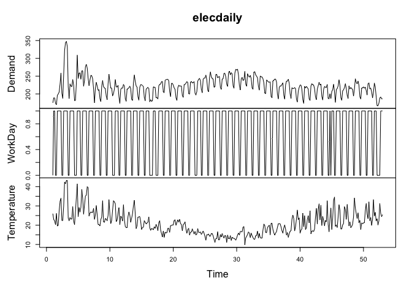
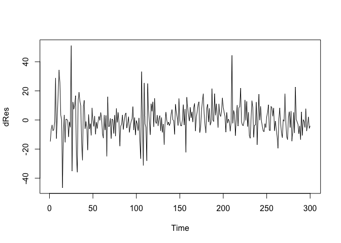
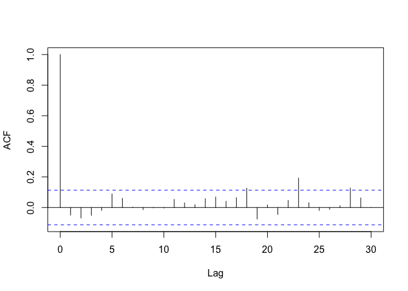
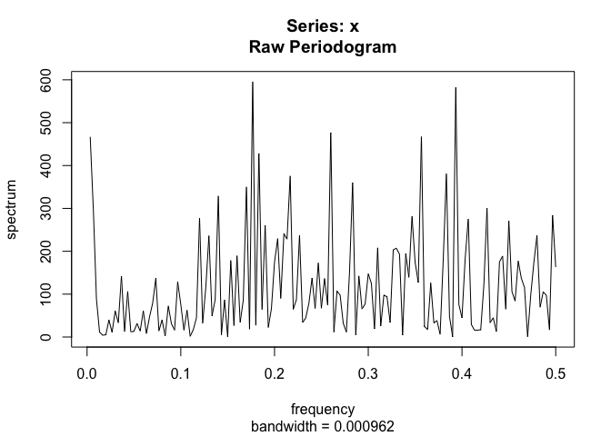
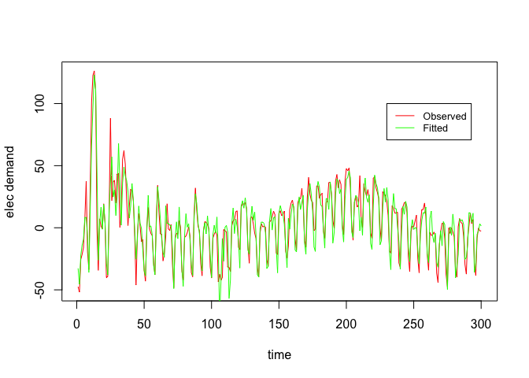
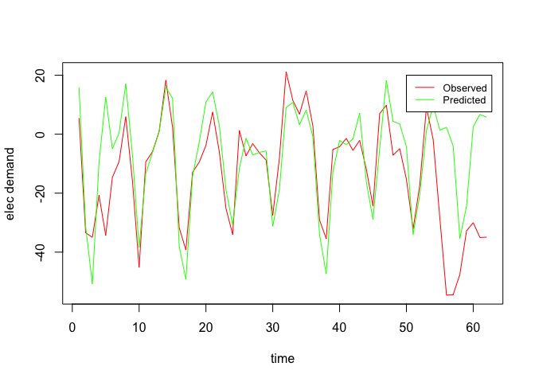

Electricity Demand Forecasting - ARIMA
================
Arunav Saikia

<h3>

Load Data

</h3>

``` r
library(fpp2)
```

    ## Loading required package: ggplot2

    ## Loading required package: forecast

    ## Registered S3 method overwritten by 'quantmod':
    ##   method            from
    ##   as.zoo.data.frame zoo

    ## Loading required package: fma

    ## Loading required package: expsmooth

``` r
plot(elecdaily)
```

<!-- -->

``` r
data <- data.frame(elecdaily)
# data <- data.frame(elecdemand)
Y <- data$Demand - mean(data$Demand) # output variable
demand <- Y
x <- data$Temperature - mean(data$Temperature) # input variable
```

<h3>

Formulate Noise Models

</h3>

Model 1 -
\[y(t) = b_0 + b_1 · y(t − 1) + b_2 · y(t-2) + b_3 · y(t-3) + b_4 · x(t) + b_5 · x(t − 1) + b_6 · x(t - 2) + b_7 · cos(2\pi f_1t) \\+ b_8 · sin(2\pi f_1t) + b_9 · cos(2\pi f_2t) + b_{10} · sin(2\pi f_2t) + b_{11} · w(t-1) + b_{12} · w(t-2) + b_{13} · w(t-3) + w(t) \]
Model 2 -
\[y(t) = b_0 + b_1 · y(t − 1) + b_2 · y(t-2) + b_3 · y(t-3) + b_4 · x(t) + b_5 · x(t − 1) + b_6 · x(t - 2) + b_7 · cos(2\pi f_1t) \\+ b_8 · sin(2\pi f_1t) + b_9 · cos(2\pi f_2t) + b_{10} · sin(2\pi f_2t) + b_{11} · w(t-1) + w(t) \]
Model 3 -
\[y(t) = b_0 + b_1 · y(t − 1) + b_2 · x(t) + b_3 · x(t − 1) + b_4 · x(t - 2) + b_5 · cos(2\pi f_1t) \\+ b_6 · sin(2\pi f_1t) + b_7 · cos(2\pi f_2t) + b_{8} · sin(2\pi f_2t) + b_{9} · w(t-1) + b_{10} · w(t-2) + b_{11} · w(t-3) + w(t) \]
Model 4 -
\[y(t) = b_0 + b_1 · y(t − 1) + b_2 · y(t-2) + b_3 · y(t-3) + b_4 · x(t) + b_5 · x(t − 1) + b_6 · cos(2\pi f_1t) \\+ b_7 · sin(2\pi f_1t) + b_8 · cos(2\pi f_2t) + b_{9} · sin(2\pi f_2t) + b_{10} · w(t-1) + w(t) \]
Model 5 -
\[y(t) = b_0 + b_1 · y(t − 1) + b_2 · y(t-2)  + b_3 · x(t) + b_4 · x(t − 1) + b_5 · cos(2\pi f_1t) \\+ b_6 · sin(2\pi f_1t) + b_7 · cos(2\pi f_2t) + b_{8} · sin(2\pi f_2t) + b_{9} · cos(2\pi f_3t) + b_{10} · sin(2\pi f_3t) + b_{11} · w(t-1) + w(t) \]

<h3>

Fit models using ARMAX

</h3>

``` r
Y <- data$Demand - mean(data$Demand) # output variable
x <- data$Temperature - mean(data$Temperature) # input variable

N = length(Y)

f1 = .1428571 # in previous assignment we found that f1 and f2
f2 = .2857143 # are two frequencies where the output signal has seasonal trend

# residuals are autocorrelated at f3 frequency so included sinusoids 
# to take make sure residuals are white noise
f3 = .429333333 

time = 1:N
cos1 = cos(2*pi*time*f1)[4:N]
sin1 = sin(2*pi*time*f1)[4:N]
cos2 = cos(2*pi*time*f2)[4:N]
sin2 = sin(2*pi*time*f2)[4:N]
cos3 = cos(2*pi*time*f3)[4:N]
sin3 = sin(2*pi*time*f3)[4:N]

dY_1 = filter(Y,c(0,1),sides=1)
dY_2 = filter(Y,c(0,0,1),sides=1)
dY_3 = filter(Y,c(0,0,0,1),sides=1)
dx_1 = filter(x,c(0,1),sides=1)
dx_2 = filter(x,c(0,0,1),sides=1)
dx_3 = filter(x,c(0,0,0,1),sides=1)

Y = Y[4:N]
x = x[4:N]
dY_1 = dY_1[4:N]
dY_2 = dY_2[4:N]
dY_3 = dY_3[4:N]
dx_1 = dx_1[4:N]
dx_2 = dx_2[4:N]
dx_3 = dx_3[4:N]

# while fitting the model we are looking at first 300 datapoints
# and we will use the future timepoints for forecasting

X1 = cbind(x,dx_1,dx_2,cos1,sin1,cos2,sin2)
res1 = arima(Y[1:300], xreg=X1[1:300,], order=c(3,0,3)) 
```

    ## Warning in arima(Y[1:300], xreg = X1[1:300, ], order = c(3, 0, 3)): possible
    ## convergence problem: optim gave code = 1

``` r
res1
```

    ## 
    ## Call:
    ## arima(x = Y[1:300], order = c(3, 0, 3), xreg = X1[1:300, ])
    ## 
    ## Coefficients:
    ##          ar1      ar2      ar3      ma1      ma2      ma3  intercept       x
    ##       1.4950  -0.4921  -0.0115  -0.7377  -0.0484  -0.0649     0.0681  1.7284
    ## s.e.  0.5605   0.8826   0.3435   0.5620   0.4787   0.1092    10.2927  0.1863
    ##         dx_1     dx_2     cos1     sin1    cos2      sin2
    ##       0.5997  -0.1339  10.0727  17.1109  4.6804  -10.1465
    ## s.e.  0.1858   0.1875   1.2199   1.2200  0.6558    0.6557
    ## 
    ## sigma^2 estimated as 130.5:  log likelihood = -1157.25,  aic = 2344.49

``` r
X2 = cbind(x,dx_1,dx_2,cos1,sin1,cos2,sin2)
res2 = arima(Y[1:300], xreg=X2[1:300,], order=c(3,0,1)) 
res2
```

    ## 
    ## Call:
    ## arima(x = Y[1:300], order = c(3, 0, 1), xreg = X2[1:300, ])
    ## 
    ## Coefficients:
    ##          ar1      ar2     ar3      ma1  intercept       x    dx_1     dx_2
    ##       1.6492  -0.6789  0.0234  -0.8909     0.0134  1.7200  0.6017  -0.1493
    ## s.e.  0.0746   0.1074  0.0611   0.0472    10.2652  0.1846  0.1850   0.1846
    ##          cos1     sin1    cos2      sin2
    ##       10.0656  17.1127  4.6804  -10.1478
    ## s.e.   1.1800   1.1800  0.6835    0.6834
    ## 
    ## sigma^2 estimated as 130.5:  log likelihood = -1157.18,  aic = 2340.36

``` r
X3 = cbind(x,dx_1,dx_2,cos1,sin1,cos2,sin2)
res3 = arima(Y[1:300], xreg=X3[1:300,], order=c(1,0,3)) 
res3
```

    ## 
    ## Call:
    ## arima(x = Y[1:300], order = c(1, 0, 3), xreg = X3[1:300, ])
    ## 
    ## Coefficients:
    ##          ar1      ma1      ma2      ma3  intercept       x    dx_1     dx_2
    ##       0.9581  -0.2057  -0.1380  -0.1248     1.4908  1.7418  0.6039  -0.1261
    ## s.e.  0.0273   0.0700   0.0733   0.0775     8.0532  0.1901  0.1890   0.1907
    ##          cos1     sin1    cos2      sin2
    ##       10.0290  17.0774  4.6820  -10.1396
    ## s.e.   1.1914   1.1909  0.6718    0.6716
    ## 
    ## sigma^2 estimated as 132.1:  log likelihood = -1158.95,  aic = 2343.91

``` r
X4 = cbind(x,dx_1,cos1,sin1,cos2,sin2)
res4 = arima(Y[1:300], xreg=X4[1:300,], order=c(3,0,1)) 
res4
```

    ## 
    ## Call:
    ## arima(x = Y[1:300], order = c(3, 0, 1), xreg = X4[1:300, ])
    ## 
    ## Coefficients:
    ##          ar1      ar2     ar3      ma1  intercept       x    dx_1     cos1
    ##       1.6443  -0.6759  0.0255  -0.8874    -0.2865  1.7420  0.6251  10.0355
    ## s.e.  0.0747   0.1074  0.0615   0.0479    10.8547  0.1826  0.1831   1.1813
    ##          sin1    cos2      sin2
    ##       17.0327  4.7004  -10.1484
    ## s.e.   1.1778  0.6849    0.6853
    ## 
    ## sigma^2 estimated as 130.8:  log likelihood = -1157.51,  aic = 2339.02

``` r
X5 = cbind(x,dx_1,cos1,sin1,cos2,sin2, cos3, sin3)
res5 = arima(Y[1:300], xreg=X5[1:300,], order=c(2,0,1)) 
res5
```

    ## 
    ## Call:
    ## arima(x = Y[1:300], order = c(2, 0, 1), xreg = X5[1:300, ])
    ## 
    ## Coefficients:
    ##          ar1     ar2     ma1  intercept       x    dx_1     cos1     sin1
    ##       0.0514  0.7120  0.8592     3.4703  1.6943  0.5229  10.0945  17.0108
    ## s.e.  0.1501  0.1364  0.1317     5.0087  0.1762  0.1758   1.1534   1.1504
    ##         cos2      sin2     cos3     sin3
    ##       4.7097  -10.1311  -0.9484  -2.1452
    ## s.e.  0.6415    0.6417   0.5008   0.4978
    ## 
    ## sigma^2 estimated as 126.9:  log likelihood = -1152.94,  aic = 2331.87

<h3>

Compare the models using BIC and AIC and Chi square (if nested)

</h3>

``` r
AIC(res1,res2,res3, res4, res5)
```

    ##      df      AIC
    ## res1 15 2344.493
    ## res2 13 2340.365
    ## res3 13 2343.909
    ## res4 12 2339.018
    ## res5 13 2331.871

``` r
BIC(res1,res2,res3, res4, res5)
```

    ##      df      BIC
    ## res1 15 2400.050
    ## res2 13 2388.514
    ## res3 13 2392.058
    ## res4 12 2383.464
    ## res5 13 2380.020

<h3>

Choose the best model of those you compared. Justify your choice.

</h3>

The best model is Model 5 which has lowest AIC and BIC scores

<h3>

Examine the residuals of the model to see if they are white noise using
autocovariance on the residuals and specral analysis of the residuals.

</h3>

``` r
dRes = res5$residuals
# hRes1 = residuals(res1)
plot.ts(dRes)
```

<!-- -->

``` r
acf(dRes, 30, main='')
```

<!-- -->

``` r
Box.test(dRes,lag = 10, type = 'Box-Pierce')
```

    ## 
    ##  Box-Pierce test
    ## 
    ## data:  dRes
    ## X-squared = 6.5552, df = 10, p-value = 0.7667

``` r
S = spectrum(dRes, log="no")
```

<!-- -->

The residuals are centered around zero and variance looks constant. The
auto-correlation plot also does not show correlation at different lag
components. From Box-Pierce test we can say that there is no significant
evidence of auto-correlation upto lag 10 components. The periodogram
looks flat with no significant peaks suggesting no autocovariance at
different frequencies. Thus the residuals are white noise.

<h3>

Interpretation of model parameters

</h3>

``` r
res5
```

    ## 
    ## Call:
    ## arima(x = Y[1:300], order = c(2, 0, 1), xreg = X5[1:300, ])
    ## 
    ## Coefficients:
    ##          ar1     ar2     ma1  intercept       x    dx_1     cos1     sin1
    ##       0.0514  0.7120  0.8592     3.4703  1.6943  0.5229  10.0945  17.0108
    ## s.e.  0.1501  0.1364  0.1317     5.0087  0.1762  0.1758   1.1534   1.1504
    ##         cos2      sin2     cos3     sin3
    ##       4.7097  -10.1311  -0.9484  -2.1452
    ## s.e.  0.6415    0.6417   0.5008   0.4978
    ## 
    ## sigma^2 estimated as 126.9:  log likelihood = -1152.94,  aic = 2331.87

The model has order 2 feedback terms and order 1 noise component. The
AR(2) term and MA(1) term are significant and positive. AR(1) is
insignificant as 95% confidence interval of the coeff will include 0.
The model also has exogenous inputs which drive the mean of the output.
There are sinuoids which capture cyclic/seasonal trends. Almost all
sinusoids are statistically significant except cos3. \(x(t)\) and
\(x(t-1)\) capture the effect of systematic input i.e temperature on the
output. Since the coefficients are positive it means there is a positive
correlation between temperature and electricity demand.

<h3>

Compare Fitted Values to Observed values

</h3>

``` r
plot(Y[1:300], type = 'l', col = 'red', xlab = 'time', ylab = 'elec demand' )
lines(Y[1:300]-res5$residuals,col="green")
legend(230, 100, legend=c("Observed", "Fitted"),
       col=c("red", "green"), lty = 1:1, cex=0.8)
```

<!-- -->

``` r
# cat("MAPE of fitted data is", mean(abs((Y[1:300]-(Y[1:300]-res5$residuals))/Y[1:300])))
accuracy(f=Y[1:300]-res5$residuals, x=Y[1:300])
```

    ##                 ME     RMSE      MAE       MPE     MAPE
    ## Test set 0.1397485 11.26526 7.925177 -98.64608 252.0293

<h3>

Plot predictions of the model for future values

</h3>

``` r
yh=predict(res5,newxreg=X5[301:362,])
plot(Y[301:362], type = 'l', col = 'red', xlab = 'time', ylab = 'elec demand' )
lines(as.numeric(yh$pred),col="green")
legend(50, 20, legend=c("Observed", "Predicted"),
       col=c("red", "green"), lty = 1:1, cex=0.8)
```

<!-- -->

``` r
accuracy(f=as.numeric(yh$pred), x= Y[301:362])
```

    ##                 ME     RMSE      MAE      MPE    MAPE
    ## Test set -5.853637 16.47991 10.95998 53.07543 111.251
