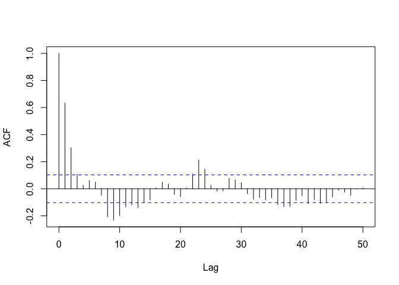

Electricity Demand Forecasting - EDA
================
Arunav Saikia

<h3>

Load Data

</h3>

``` r
library(fpp2)
```

    ## Loading required package: ggplot2

    ## Loading required package: forecast

    ## Registered S3 method overwritten by 'quantmod':
    ##   method            from
    ##   as.zoo.data.frame zoo

    ## Loading required package: fma

    ## Loading required package: expsmooth

``` r
library(stats)
library(polyreg)
# plot(elecdaily)
# plot(elecdemand)
```

<h3>

Data Analysis

</h3>

``` r
data <- data.frame(elecdaily)
# data <- data.frame(elecdemand)
plot(data$Demand, type = 'l', main = 'Electricity Demand', xlab = 'Day of Year', ylab = 'Demand (GW)')
```

<!-- -->

``` r
plot(data$Temperature, type = 'l', main = 'Max Temperatures', xlab = 'Day of Year', ylab = 'Temperature (C)')
```

<!-- -->

``` r
demand <- data$Demand - mean(data$Demand)
temp <- data$Temperature - mean(data$Temperature)
```

``` r
N = 365
T1 = 1:N
T1 = (T1 - mean(T1))/sd(T1) #normalize for numerical stability

aic_demand = c()
for (val in c(1:20)) {
     aic_demand[val] = AIC(lm(demand~poly(T1,val)))
}
plot(aic_demand, type = 'l', main = 'AIC vs degree of polynomial', xlab = 'degree')
```

<!-- -->

``` r
aic_temp = c()
for (val in c(1:20)) {
     aic_temp[val] = AIC(lm(temp~poly(T1,val)))
}
plot(aic_temp, type = 'l', main = 'AIC vs degree of polynomial', xlab = 'degree')
```

<!-- -->

``` r
res_demand = lm(demand~poly(T1,6))
summary(res_demand)
```

    ## 
    ## Call:
    ## lm(formula = demand ~ poly(T1, 6))
    ## 
    ## Residuals:
    ##     Min      1Q  Median      3Q     Max 
    ## -63.170 -18.247   2.861  13.548 111.421 
    ## 
    ## Coefficients:
    ##                Estimate Std. Error t value Pr(>|t|)    
    ## (Intercept)   1.062e-14  1.176e+00   0.000 1.000000    
    ## poly(T1, 6)1 -8.937e+01  2.246e+01  -3.978 8.40e-05 ***
    ## poly(T1, 6)2 -8.475e+01  2.246e+01  -3.773 0.000189 ***
    ## poly(T1, 6)3 -9.577e+01  2.246e+01  -4.263 2.58e-05 ***
    ## poly(T1, 6)4  7.076e+01  2.246e+01   3.150 0.001771 ** 
    ## poly(T1, 6)5  9.061e+01  2.246e+01   4.033 6.72e-05 ***
    ## poly(T1, 6)6 -2.001e+02  2.246e+01  -8.909  < 2e-16 ***
    ## ---
    ## Signif. codes:  0 '***' 0.001 '**' 0.01 '*' 0.05 '.' 0.1 ' ' 1
    ## 
    ## Residual standard error: 22.46 on 358 degrees of freedom
    ## Multiple R-squared:  0.3005, Adjusted R-squared:  0.2888 
    ## F-statistic: 25.63 on 6 and 358 DF,  p-value: < 2.2e-16

``` r
demandR = residuals(res_demand)
plot(demandR, main='residuals')
```

<!-- -->

``` r
demandR_filtered = filter(demandR^2, rep(1/10,10), sides = 2)
plot(demandR_filtered, main = 'variance')
```

<!-- -->

``` r
res_temp = lm(temp~poly(T1,4))
summary(res_temp)
```

    ## 
    ## Call:
    ## lm(formula = temp ~ poly(T1, 4))
    ## 
    ## Residuals:
    ##     Min      1Q  Median      3Q     Max 
    ## -8.2438 -2.6956 -0.4615  2.0507 14.9204 
    ## 
    ## Coefficients:
    ##                Estimate Std. Error t value Pr(>|t|)    
    ## (Intercept)   4.046e-16  2.160e-01   0.000    1.000    
    ## poly(T1, 4)1 -2.487e+01  4.126e+00  -6.028 4.12e-09 ***
    ## poly(T1, 4)2  7.701e+01  4.126e+00  18.664  < 2e-16 ***
    ## poly(T1, 4)3  4.041e+00  4.126e+00   0.979    0.328    
    ## poly(T1, 4)4 -3.270e+01  4.126e+00  -7.926 2.86e-14 ***
    ## ---
    ## Signif. codes:  0 '***' 0.001 '**' 0.01 '*' 0.05 '.' 0.1 ' ' 1
    ## 
    ## Residual standard error: 4.126 on 360 degrees of freedom
    ## Multiple R-squared:  0.5547, Adjusted R-squared:  0.5498 
    ## F-statistic: 112.1 on 4 and 360 DF,  p-value: < 2.2e-16

``` r
tempR = residuals(res_temp)
plot(tempR, main='residuals')
```

<!-- -->

``` r
tempR_filtered = filter(tempR^2, rep(1/10,10), sides = 2)
plot(tempR_filtered, main = 'variance')
```

<!-- -->

Look for periodic trends

``` r
# demandper = spec.pgram(demand,spans=c(25,25),taper=0,log="no")
demandRper = spec.pgram(demandR,spans=c(25,25),taper=0,log="no")
```

<!-- -->

``` r
tempRper = spec.pgram(tempR,spans=c(25,25),taper=0,log="no")
```

<!-- -->

``` r
#.1440,.2853
f1 = .1428571
f2 = .2857143
time = 1:N
cos1 = cos(2*pi*time*f1)
sin1 = sin(2*pi*time*f1)
cos2 = cos(2*pi*time*f2)
sin2 = sin(2*pi*time*f2)

f3 = .1706667
cos3 = cos(2*pi*time*f3)
sin3 = sin(2*pi*time*f3)
# aic = c()
# for (val in c(1:20)) {
#      aic[val] = AIC(lm(demand~poly(T1,val)+cos1+sin1+cos2+sin2))
# }
# plot(aic, type = 'l', main = 'AIC vs degree of polynomial', xlab = 'degree')
```

``` r
res_demand_new = lm(demand~poly(T1,6)+cos1+sin1+cos2+sin2)
summary(res_demand_new)
```

    ## 
    ## Call:
    ## lm(formula = demand ~ poly(T1, 6) + cos1 + sin1 + cos2 + sin2)
    ## 
    ## Residuals:
    ##     Min      1Q  Median      3Q     Max 
    ## -42.174  -7.418  -0.708   6.178 101.707 
    ## 
    ## Coefficients:
    ##                Estimate Std. Error t value Pr(>|t|)    
    ## (Intercept)    -0.02143    0.86738  -0.025 0.980305    
    ## poly(T1, 6)1  -89.28361   16.57284  -5.387 1.31e-07 ***
    ## poly(T1, 6)2  -85.73782   16.57229  -5.174 3.85e-07 ***
    ## poly(T1, 6)3  -95.63650   16.57518  -5.770 1.73e-08 ***
    ## poly(T1, 6)4   69.22311   16.57354   4.177 3.73e-05 ***
    ## poly(T1, 6)5   90.76520   16.57721   5.475 8.29e-08 ***
    ## poly(T1, 6)6 -202.37681   16.57519 -12.210  < 2e-16 ***
    ## cos1           10.50488    1.22764   8.557 3.57e-16 ***
    ## sin1           15.19898    1.22680  12.389  < 2e-16 ***
    ## cos2            4.38723    1.22828   3.572 0.000404 ***
    ## sin2           -9.88119    1.22541  -8.064 1.16e-14 ***
    ## ---
    ## Signif. codes:  0 '***' 0.001 '**' 0.01 '*' 0.05 '.' 0.1 ' ' 1
    ## 
    ## Residual standard error: 16.57 on 354 degrees of freedom
    ## Multiple R-squared:  0.6236, Adjusted R-squared:  0.613 
    ## F-statistic: 58.65 on 10 and 354 DF,  p-value: < 2.2e-16

``` r
demandR_new = residuals(res_demand_new)
plot(demandR_new, main='residuals')
```

<!-- -->

``` r
plot(filter(demandR_new^2, rep(1/10,10), sides = 1), main = 'variance')
```

<!-- -->

``` r
demandR_new_per = spec.pgram(demandR_new,spans=c(50,50),taper=0,log="no")
```

<!-- -->

``` r
res_temp_new = lm(temp~poly(T1,4)+cos3+sin3)
summary(res_temp_new)
```

    ## 
    ## Call:
    ## lm(formula = temp ~ poly(T1, 4) + cos3 + sin3)
    ## 
    ## Residuals:
    ##     Min      1Q  Median      3Q     Max 
    ## -7.9502 -2.5561 -0.4994  2.1826 15.0158 
    ## 
    ## Coefficients:
    ##                Estimate Std. Error t value Pr(>|t|)    
    ## (Intercept)    0.001768   0.215170   0.008   0.9934    
    ## poly(T1, 4)1 -24.815705   4.110869  -6.037 3.94e-09 ***
    ## poly(T1, 4)2  77.081997   4.111122  18.750  < 2e-16 ***
    ## poly(T1, 4)3   4.121403   4.111022   1.003   0.3168    
    ## poly(T1, 4)4 -32.598008   4.111460  -7.929 2.85e-14 ***
    ## cos3          -0.554942   0.304768  -1.821   0.0695 .  
    ## sin3          -0.353421   0.303932  -1.163   0.2457    
    ## ---
    ## Signif. codes:  0 '***' 0.001 '**' 0.01 '*' 0.05 '.' 0.1 ' ' 1
    ## 
    ## Residual standard error: 4.111 on 358 degrees of freedom
    ## Multiple R-squared:  0.5604, Adjusted R-squared:  0.5531 
    ## F-statistic: 76.07 on 6 and 358 DF,  p-value: < 2.2e-16

``` r
tempR_new = residuals(res_temp_new)
plot(tempR_new, main='residuals')
```

<!-- -->

``` r
plot(filter(tempR_new^2, rep(1/10,10), sides = 1), main = 'variance')
```

<!-- -->

``` r
tempR_new_per = spec.pgram(tempR_new,spans=c(50,50),taper=0,log="no")
```

<!-- -->

``` r
# acf(demandR, 50, main="Demand")
# pacf(demandR, 50, main="Demand")

acf(demandR_new, 50, main = '')
```

<!-- -->

``` r
acf(tempR_new, 50, main = '')
```

<!-- -->

``` r
# pacf(demandR_new, 50, main="Demand")
```

``` r
ccf(demandR_new, tempR_new, main = '')
```

<!-- -->

``` r
AH = cbind(tempR_new, demandR_new)

 # spectrum(AH,log="no")
 H = spectrum(AH,spans=c(20,20),taper=0,log="no",plot=FALSE)
 plot(H$freq,H$coh,type="l",xlab="freq")
```

<!-- -->
