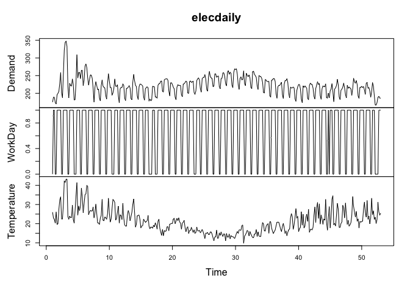
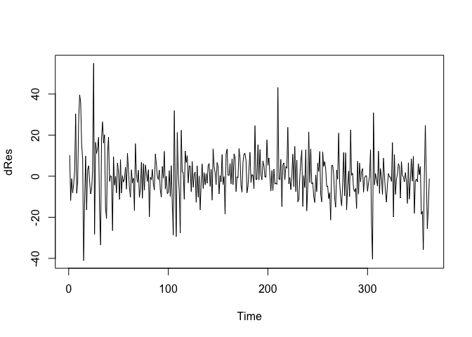
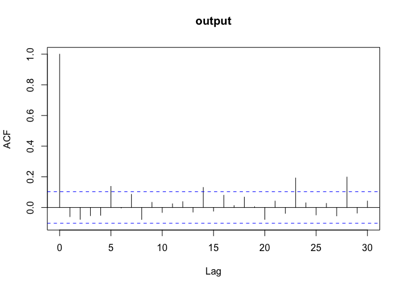
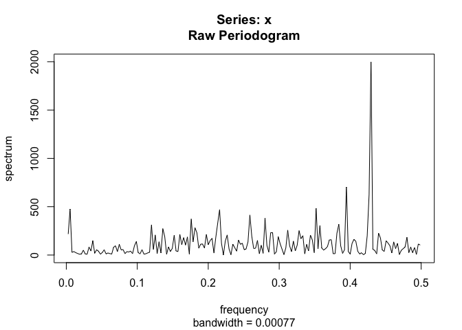
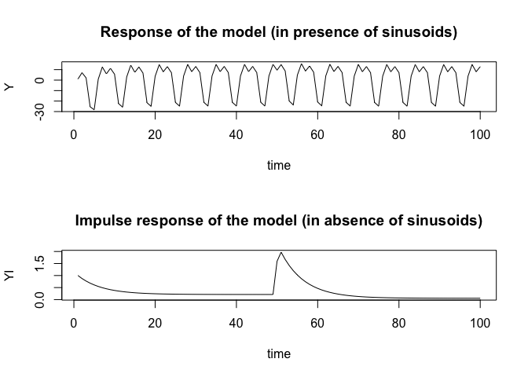
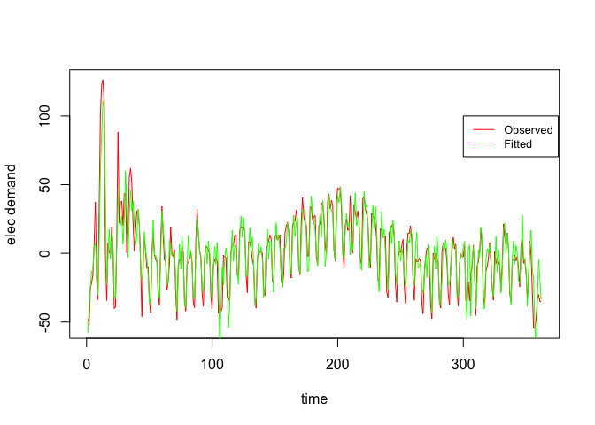

Electricity Demand Forecasting - Linear Difference Eq
================
Arunav Saikia

<h3>

Load Data

</h3>

``` r
library(fpp2)
```

    ## Loading required package: ggplot2

    ## Loading required package: forecast

    ## Registered S3 method overwritten by 'quantmod':
    ##   method            from
    ##   as.zoo.data.frame zoo

    ## Loading required package: fma

    ## Loading required package: expsmooth

``` r
plot(elecdaily)
```

<!-- -->

``` r
data <- data.frame(elecdaily)
# data <- data.frame(elecdemand)
Y <- data$Demand - mean(data$Demand)
demand <- Y
x <- data$Temperature - mean(data$Temperature)
```

<h3>

Fit Models

</h3>

Simple Model -
\(y(t) = b_0 + b_1 · y(t − 1) + b_2 · x(t) + b_3 · cos(2\pi f_1t) + b_4 · sin(2\pi f_1t) + b_5 · cos(2\pi f_2t) + b_6 · sin(2\pi f_2t) + w(t)\)
Complex Model -
\[y(t) = b_0 + b_1 · y(t − 1)  + b_2 · y(t - 2) + b_3 · y(t - 3) + b_4 · x(t) + b_5 · x(t − 1) + b_6 · x(t - 2) + b_7 · x(t - 3)\\ + b_8 · cos(2\pi f_1t) + b_9 · sin(2\pi f_1t) + b_{10} · cos(2\pi f_2t) + b_{11} ·  sin(2\pi f_2t) + w(t)\]
Third Model
-\[y(t) = b_0 + b_1 · y(t − 1) + b_2 · x(t) + b_3 · x(t − 1) + b_4 · x(t - 2)\\ + b_5 · cos(2\pi f_1t) + b_6 · cos(2\pi f_2t) + b_7 · sin(2\pi f_2t) + w(t)\]

``` r
N = length(Y)

f1 = .1428571 # in previous assignment we found that f1 and f2
f2 = .2857143 # are two frequencies where the signal has seasonal trend
time = 1:N
cos1 = cos(2*pi*time*f1)[4:N]
sin1 = sin(2*pi*time*f1)[4:N]
cos2 = cos(2*pi*time*f2)[4:N]
sin2 = sin(2*pi*time*f2)[4:N]

dY_1 = filter(Y,c(0,1),sides=1)
dY_2 = filter(Y,c(0,0,1),sides=1)
dY_3 = filter(Y,c(0,0,0,1),sides=1)
dx_1 = filter(x,c(0,1),sides=1)
dx_2 = filter(x,c(0,0,1),sides=1)
dx_3 = filter(x,c(0,0,0,1),sides=1)

Y = Y[4:N]
x = x[4:N]
dY_1 = dY_1[4:N]
dY_2 = dY_2[4:N]
dY_3 = dY_3[4:N]
dx_1 = dx_1[4:N]
dx_2 = dx_2[4:N]
dx_3 = dx_3[4:N]

res1 = lm(Y~dY_1+x+cos1+sin1+cos2+sin2)  # 5 parms
res2 = lm(Y~dY_1+dY_2+dY_3+x+dx_1+dx_2+dx_3+cos1+sin1+cos2+sin2) # 10 parms
res3 = lm(Y~dY_1+x+dx_1+dx_2+cos1+cos2+sin2) # 6 parms
summary(res1) # Simple model
```

    ## 
    ## Call:
    ## lm(formula = Y ~ dY_1 + x + cos1 + sin1 + cos2 + sin2)
    ## 
    ## Residuals:
    ##     Min      1Q  Median      3Q     Max 
    ## -63.882  -6.688   0.539   6.821  60.230 
    ## 
    ## Coefficients:
    ##              Estimate Std. Error t value Pr(>|t|)    
    ## (Intercept)   0.07997    0.68945   0.116 0.907723    
    ## dY_1          0.79044    0.03193  24.755  < 2e-16 ***
    ## x             0.43103    0.11200   3.849 0.000141 ***
    ## cos1         14.61401    0.99170  14.736  < 2e-16 ***
    ## sin1          1.41645    1.13321   1.250 0.212142    
    ## cos2         -2.57875    1.01299  -2.546 0.011328 *  
    ## sin2        -14.90483    0.99368 -15.000  < 2e-16 ***
    ## ---
    ## Signif. codes:  0 '***' 0.001 '**' 0.01 '*' 0.05 '.' 0.1 ' ' 1
    ## 
    ## Residual standard error: 13.12 on 355 degrees of freedom
    ## Multiple R-squared:  0.7596, Adjusted R-squared:  0.7555 
    ## F-statistic: 186.9 on 6 and 355 DF,  p-value: < 2.2e-16

``` r
summary(res2) # Complex model
```

    ## 
    ## Call:
    ## lm(formula = Y ~ dY_1 + dY_2 + dY_3 + x + dx_1 + dx_2 + dx_3 + 
    ##     cos1 + sin1 + cos2 + sin2)
    ## 
    ## Residuals:
    ##     Min      1Q  Median      3Q     Max 
    ## -41.391  -6.220  -0.375   5.643  53.621 
    ## 
    ## Coefficients:
    ##               Estimate Std. Error t value Pr(>|t|)    
    ## (Intercept)   0.038566   0.625810   0.062 0.950897    
    ## dY_1          0.776519   0.053376  14.548  < 2e-16 ***
    ## dY_2         -0.009666   0.067478  -0.143 0.886179    
    ## dY_3          0.078020   0.052786   1.478 0.140294    
    ## x             1.426680   0.158242   9.016  < 2e-16 ***
    ## dx_1         -0.678636   0.197065  -3.444 0.000643 ***
    ## dx_2         -0.515220   0.199333  -2.585 0.010150 *  
    ## dx_3         -0.269250   0.174466  -1.543 0.123668    
    ## cos1         15.603787   1.129607  13.813  < 2e-16 ***
    ## sin1          2.823893   1.383382   2.041 0.041971 *  
    ## cos2         -2.408913   1.227693  -1.962 0.050537 .  
    ## sin2        -13.854884   1.204553 -11.502  < 2e-16 ***
    ## ---
    ## Signif. codes:  0 '***' 0.001 '**' 0.01 '*' 0.05 '.' 0.1 ' ' 1
    ## 
    ## Residual standard error: 11.9 on 350 degrees of freedom
    ## Multiple R-squared:  0.8047, Adjusted R-squared:  0.7986 
    ## F-statistic: 131.1 on 11 and 350 DF,  p-value: < 2.2e-16

``` r
summary(res3) # Third model
```

    ## 
    ## Call:
    ## lm(formula = Y ~ dY_1 + x + dx_1 + dx_2 + cos1 + cos2 + sin2)
    ## 
    ## Residuals:
    ##     Min      1Q  Median      3Q     Max 
    ## -40.976  -6.454  -0.329   6.158  55.017 
    ## 
    ## Coefficients:
    ##              Estimate Std. Error t value Pr(>|t|)    
    ## (Intercept)   0.03336    0.62668   0.053 0.957577    
    ## dY_1          0.84260    0.02541  33.160  < 2e-16 ***
    ## x             1.37980    0.15441   8.936  < 2e-16 ***
    ## dx_1         -0.78314    0.18750  -4.177 3.73e-05 ***
    ## dx_2         -0.62132    0.15313  -4.058 6.10e-05 ***
    ## cos1         14.97108    0.89842  16.664  < 2e-16 ***
    ## cos2         -3.31586    0.91484  -3.625 0.000332 ***
    ## sin2        -15.02833    0.89932 -16.711  < 2e-16 ***
    ## ---
    ## Signif. codes:  0 '***' 0.001 '**' 0.01 '*' 0.05 '.' 0.1 ' ' 1
    ## 
    ## Residual standard error: 11.92 on 354 degrees of freedom
    ## Multiple R-squared:  0.8019, Adjusted R-squared:  0.798 
    ## F-statistic: 204.7 on 7 and 354 DF,  p-value: < 2.2e-16

Compare the complex and nested models using an F test.

``` r
anova(res1, res2)
```

    ## Analysis of Variance Table
    ## 
    ## Model 1: Y ~ dY_1 + x + cos1 + sin1 + cos2 + sin2
    ## Model 2: Y ~ dY_1 + dY_2 + dY_3 + x + dx_1 + dx_2 + dx_3 + cos1 + sin1 + 
    ##     cos2 + sin2
    ##   Res.Df   RSS Df Sum of Sq      F    Pr(>F)    
    ## 1    355 61062                                  
    ## 2    350 49596  5     11466 16.183 2.321e-14 ***
    ## ---
    ## Signif. codes:  0 '***' 0.001 '**' 0.01 '*' 0.05 '.' 0.1 ' ' 1

Compare the non nested model to the other two using BIC and AIC.

``` r
AIC(res1, res2, res3)
```

    ##      df      AIC
    ## res1  8 2899.646
    ## res2 13 2834.360
    ## res3  9 2831.569

``` r
BIC(res1, res2, res3)
```

    ##      df      BIC
    ## res1  8 2930.779
    ## res2 13 2884.951
    ## res3  9 2866.594

<b>By looking at the F-test we see that we get a p-value \< 0.01
significance level, which means we can reject the Null hypothesis and
both models are not same. By looking at the AIC/BIC we can see that the
third model is best as it has lowest AIC and BIC scores</b>

<h3>

Examine the residuals of the model to see if they are white noise using
autocovariance on the residuals and specral analysis of the residuals.

</h3>

``` r
dRes = res3$residuals
# hRes1 = residuals(res1)
plot.ts(dRes)
```

<!-- -->

``` r
acf(dRes, 30, main="output")
```

<!-- -->

``` r
Box.test(dRes,lag = 10, type = 'Box-Pierce')
```

    ## 
    ##  Box-Pierce test
    ## 
    ## data:  dRes
    ## X-squared = 18.023, df = 10, p-value = 0.05458

``` r
spectrum(dRes, log="no")
```

<!-- --> <b>
By looking at the plots of the residuals it looks like the mean is 0 and
variance is constant. The ACF and periodogram has no evidence of strong
autocorrelation. The Box-Pierce test gives a p-value=0.054\>0.05
significance, therefore we cannot reject the Null hypothesis that the
autocorrelation at different lag components is 0. Thus we can conclude
that the residuals are white noise</b>

Interpret the parameters of the model. What do they imply for the effect
of the lagged feedback? Is the model stable? What do they imply for the
effect of the input on the output?

``` r
# To check for effect of input and lagged output on the model (i.e. dynamics) we will pass a step input 
# throught the difference equation model and observe the response. Since our model has sine, cosine pair we 
# expect some systematic oscillations in the output
N = 100 
x = array( 0, dim=c(N,1))
x[N/2] = 1 

# Create a step input
Sx = array(0, dim = c(N,1))
sum = 0
for (index in 1:N) {
  sum = sum + x[index]
  Sx[index] = sum 
}
x = Sx

Y = array( 0, dim=c(N,1))
YI = array( 0, dim=c(N,1))
# coefficients from our linear difference eq model
b0 = res3$coefficients[1]
b1 = res3$coefficients[2]
b2 = res3$coefficients[3]
b3 = res3$coefficients[4]
b4 = res3$coefficients[5]
b5 = res3$coefficients[6]
b6 = res3$coefficients[7]
b7 = res3$coefficients[8]

f1 = .1428571 # in previous assignment we found that f1 and f2
f2 = .2857143 # are two frequencies where the signal has external seasonal trend
time = 1:N
cos1 = cos(2*pi*time*f1)
sin1 = sin(2*pi*time*f1)
cos2 = cos(2*pi*time*f2)
sin2 = sin(2*pi*time*f2)

for (index in 1:N) {
  if (index == 1) {
    Y[index] = 1
    YI[index] = 1
    }
  if (index ==2 ){
    Y[index] = b0 + b1*Y[index-1]  + b2*x[index] + b3*x[index-1] + b5*cos1[index] + b6*cos2[index] + b7*sin2[index]
    YI[index] = b0 + b1*YI[index-1]  + b2*x[index] + b3*x[index-1]
    }

  if (index >2){
    Y[index] = b0 + b1*Y[index-1]  + b2*x[index] + b3*x[index-1] + b4*x[index-2] + b5*cos1[index] + b6*cos2[index] + b7*sin2[index]
    YI[index] = b0 + b1*YI[index-1]  + b2*x[index] + b3*x[index-1] + b4*x[index-2]
    }
}

layout( matrix( c(1,2), nrow=2, ncol=1, byrow="FALSE"))
plot(Y,type="l",xlab="time", main = 'Response of the model (in presence of sinusoids)')
plot(YI,type="l",xlab="time", main = 'Impulse response of the model (in absence of sinusoids)')
```

<!-- -->

``` r
F = c(res3$coefficients[2] ) # Since we have only 1 feedback term in our best model our
F = array(F, dim=c(1,1)) # feedback matrix is 1x1
ev<-eigen(F) # Stability of the model is determined by the lagged feedback terms
# ev$val
abs(ev$val)
```

    ## [1] 0.8426012

<b> Since the absolute value of the eigen value of the feedback matrix
is \<1 the system is stable. This is also justified by the response of
the model where the systematic oscillations are due to the sinusoids
used to model external seasonal trends, but otherwise we can see that
output oscillates about a equilibrium value. In absence of sinusoid
inputs we can see the model decays to an equilibrium</b>

Plot the model predictions for the output and compare these to the
observed.

``` r
plot(demand[4:365], type = 'l', col = 'red', xlab = 'time', ylab = 'elec demand' )
lines(res3$fitted.values,col="green")
legend(300, 100, legend=c("Observed", "Fitted"),
       col=c("red", "green"), lty = 1:1, cex=0.8)
```

<!-- -->
